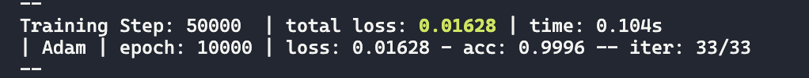
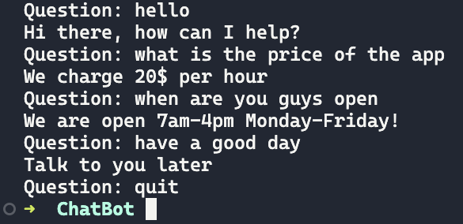

<<<<<<< HEAD
# ChatBot APP
A ChatBot implementation using [NLTK (Natural Language Tool Kit)](https://www.nltk.org)

# Available Scripts
In the project directory, you can run:

python chatbot.py

## Model Architecture
```py
network = tfl.input_data(shape=[None, len(training_data[0])])
network = tfl.fully_connected(network, 8) 
network = tfl.fully_connected(network, 8) 
network = tfl.fully_connected(network, len(output_data[0]), activation='softmax') 
network = tfl.regression(network)

model = tfl.DNN(network)
```
### Dataset used
```
intents.json
```

# Outputs
Accuracy === acc
| |
| ---------------------------------------------- | 
|  | 

### Requirements
```
1. tensorflow==2.2.1
2. numpy==1.18.5
3. tflearn==0.5.0
4. pandas==1.0.4
5. nltk==3.7
```

# Learn More
To Learn [Python](https://www.python.org/doc/)\
To Know More About [Numpy](https://numpy.org)\
To Know More About [Pandas](https://pandas.pydata.org)\
To Know More About [Tensorflow](https://jinja.palletsprojects.com/en/3.1.x/)\
To Know More About [TFLearn](http://tflearn.org)\
To Know More About [NLTK](https://www.nltk.org)